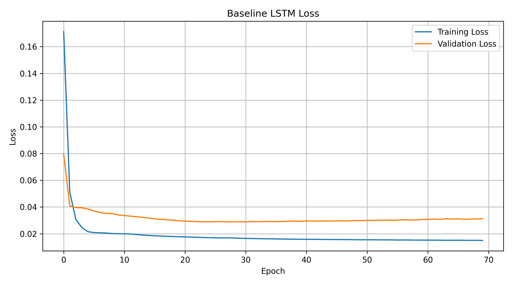
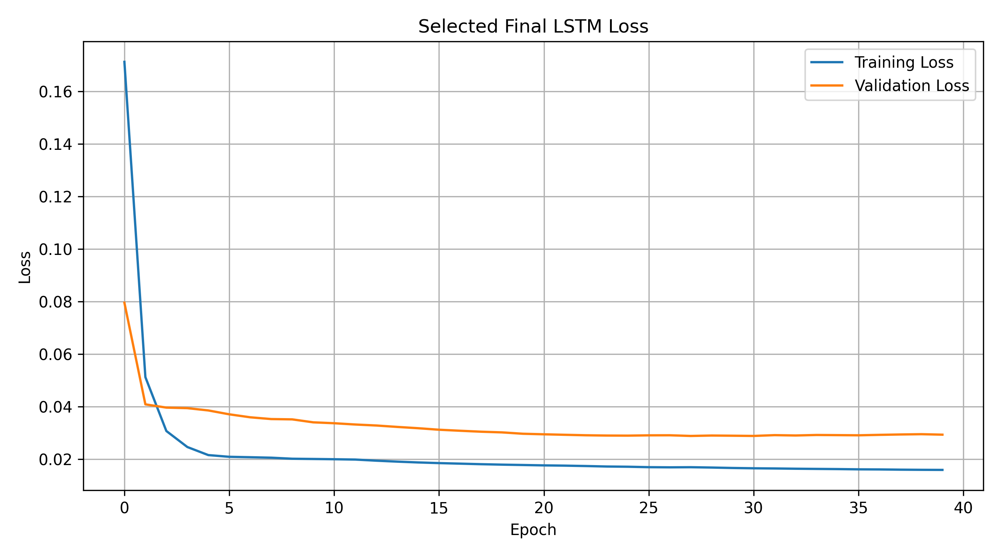

## Utilizing Advanced Techniques for LSTM Network Optimization in Temperature Prediction: A Case Study in Bogura, Bangladesh

## 1. Problem Understanding & Originality

## 1.1 Problem Statement
**Bogura’s rainfall is highly seasonal with extreme monthly variations [1]. Reliable forecasting assists in proper flood-risk management, drought preparedness planning, and other disaster management decision-making [2, 3]. The meteorological data of Bogura, Bangladesh, from 1990 to 2025 were used in this study, which were obtained from the NASA POWER database [4]. The key problem statement revolves around the ability to predict rainfall for the following month based on weather data from the previous six months and seasonal trends. The main challenge of this model is to handle the annual monsoon cycle with extreme events and dry months. As it is a historical sequence learning, the 2024 observations were reserved for validation and model selection, and the 2025 observations were used for the final test.**

## 1.2 Justification for Deep Learning
**The choice of deep learning models is justified by the presence of complex and nonlinear interactions between the various weather variables impacting rainfall prediction. Current and historical information, along with the presence of seasonality, becomes an essential part of the process. Long Short-Term Memory (LSTM) Neural Network models have been chosen specifically for this research as they have been designed for sequential and time-series data [5]. Moreover, LSTM provides a suitable experimental framework for studying capacity, optimization stability, regularization, and early stopping under a fixed time-series pipeline [6, 7, 8].**

## 1.3 Objectives & Expected Outcomes
**Objectives** 
-	To develop an LSTM model using historical weather data for monthly rainfall forecasting in Bogura.
-	To explore advanced learning strategies’ effects and boost model accuracy by implementing regularization techniques.

**Expected Outcomes**
-	A consistent model that can adapt to seasonality and forecast monthly rainfall with precision.
-	Optimized LSTM model that outperformed the baseline model with clear identification of which advanced techniques boost model performance. 

## 2. Data Handling & Preprocessing

### 2.1 Dataset Description

| Item | Description |
|---|---|
| **Dataset Source** | NASA POWER Source Native Resolution Daily Data for Bogra, Bangladesh |
| **Original Samples** | 13,149 daily records |
| **Monthly Samples** | 432 months before lagging; 420 usable months after 12-month lag/rolling |
| **Sequence Samples** | 414 sequences of 6 months each |
| **No. of Features** | 17 features per monthly time step |
| **Target Variable** | Next-month total rainfall (mm); `log1p` transformed during training |
| **Train / Validation / Test** | 390 sequences (through 2023) / 12 sequences (2024) / 12 sequences (2025) |

### 2.2 Preprocessing Steps Applied

| Technique | Observation |
|---|---|
| **Missing-value handling** | `-999` was treated as missing, followed by forward fill and training-period medians. According to the extract, 0 sentinel values and 0 weather NaNs. |
| **Monthly aggregation** | Summed daily rainfall, while averaged humidity, temperature, and solar radiation. |
| **Feature engineering** | Cyclical month encoding; rainfall lags at 1, 2, 3, 6, 12 months; 3, 6, 12-month rainfall means; 3-month humidity and temperature means. |
| **Scaling** | `MinMaxScaler` was fitted on training rows & applied to validation & test data. |
| **Sequence construction** | Each sample used the previous six monthly rows to predict the following month. shuffle=False preserved temporal order. |

## 2.3 Effect of Data Scaling on Training Stability
**With MinMax scaling, validation RMSE was 65.29 mm; without scaling, it increased to 115.16 mm. Scaling therefore reduced validation RMSE by 43.31%.** 


**Figure 1. Validation RMSE with and without MinMax scaling.**

## 3. Model Design & Justification

### 3.1 Architecture Summary

| Component | Description |
|---|---|
| **Architecture Type** | Many-to-one LSTM regression network |
| **Input Shape** | 6 time steps × 17 features |
| **Trainable Layers** | `LSTM(32)` → `Dense(16, ReLU)` → `Dense(1, Linear)` |
| **Trainable Parameters** | 6,945 parameters |
| **Activation Functions** | `tanh` in the selected LSTM, `ReLU` in the dense representation, and a linear activation in the output layer |
| **Batch Normalization** | Implemented experimentally but rejected based on validation performance |
| **Pretraining** | Greedy layer-wise pretraining was implemented and compared with end-to-end training from scratch |

#### Selected Final LSTM Architecture


*Figure 2. Selected final LSTM architecture.*

### 3.2 Capacity Configuration: Nodes and Layers

| Configuration | Validation RMSE | Validation R² | Observation |
|---|---:|---:|---|
| **16-node single LSTM** | 64.54 | 0.878 | Slightly lower RMSE than the 32-node baseline; low capacity was adequate. |
| **32-node single LSTM** | 65.29 | 0.875 | Baseline capacity; stable and used for the final candidate search. |
| **64-node single LSTM** | 78.53 | 0.819 | Higher capacity overfit and worsened validation error. |
| **64 → 32 stacked LSTM** | 71.17 | 0.851 | Deeper model did not improve the small monthly dataset. |

**As the capacity configuration shows that more nodes and layers did not guarantee better generalization, the final search retained the compact 32-node architecture.**

### 3.3 Training and Gradient-Stability Techniques

| Technique | Experimented | Validation RMSE | Observation |
|---|:---:|---:|---|
| **ReLU activation** | Yes | 59.23 | ReLU inside the LSTM improved RMSE by 6.05 mm. |
| **Gradient clipping** | Yes | 61.70 | Adam clipnorm=1.0 reduced RMSE by 3.58 mm relative to baseline. |
| **Batch normalization** | Yes | 264.58 | Severe degradation; rejected. Small batches and recurrent sequence statistics were not favourable. |
| **Greedy layer-wise pretraining** | Yes | 70.51 | Pretrained first recurrent layer, froze it briefly, then fine-tuned. Worse than deep scratch. |

## 3.4 Architecture Justification

**The network of this study is kept compact using a 32-unit LSTM and a 16-unit ReLU dense layer for precise rainfall prediction without shrinking the limited dataset. This study skipped techniques like batch normalization, dropout, and L2 regularization, which can negatively impact the model performance.**

## 4. Implementation Quality

## 4. Model Training and Hyperparameter Optimization

### 4.1 Hyperparameter Configuration

| Hyperparameter | Values Experimented | Final Selection | Reason |
|---|---|---|---|
| Learning rate | 0.01, 0.001, 0.0001; ReduceLROnPlateau | 0.001 | Best stable validation trajectory. |
| Optimizer | Adam | Adam | Adaptive optimization fitted for the recurrent model [6]. |
| Batch size | 4, 8, 16, 32 | 8 | Baseline batch was preserved for the selected candidate. |
| Loss function | MSE, MAE, Huber | MSE | Addresses large rainfall errors and matched RMSE selection. |
| Epochs | 70, 120, 150 | Maximum 150; stopped at 40 | For selecting the best epoch |
| Activation & Regularization | tanh, ReLU; L2, activity L1, MaxNorm, dropout, noise | tanh in LSTM; ReLU dense; early stopping | Validation-selected configuration prevents overfitting |

## 4.2 Optimization Strategy

**Training this recurrent network is tricky because its complex error landscape is highly sensitive to the learning rate, where 0.01 causes unstable noise and 0.0001 stalls progress, making 0.001 the sweet spot for stable convergence. Gradient clipping improved robustness by limiting unusually large updates, while early stopping protected against continued fitting after validation performance stopped improving.**

## 4.3 Key Code Snippet

```python
def compile_model(model, cfg):
    opt = {"learning_rate":cfg["lr"]}
    if cfg["clipnorm"] is not None: opt["clipnorm"] = cfg["clipnorm"]
    model.compile(optimizer=Adam(**opt), loss=cfg["loss"], metrics=["mae"])
    return model
def build_model(cfg, shape, name):
    m = Sequential(name=name); m.add(Input(shape=shape))
    if cfg["noise"]: m.add(GaussianNoise(cfg["noise"], name="noise"))
    for i,u in enumerate(cfg["units"]):
        m.add(LSTM(u, activation=cfg["activation"], return_sequences=i<len(cfg["units"])-1,
            kernel_regularizer=l2(cfg["weight_l2"]) if cfg["weight_l2"] else None,
            activity_regularizer=l1(cfg["activity_l1"]) if cfg["activity_l1"] else None,
            kernel_constraint=MaxNorm(cfg["max_norm"]) if cfg["max_norm"] else None, name=f"lstm_{i}"))
        if cfg["batch_norm"]: m.add(BatchNormalization(name=f"batch_norm_{i}"))
        if cfg["dropout"]: m.add(Dropout(cfg["dropout"], name=f"dropout_{i}"))
    m.add(Dense(16, activation="relu", name="dense_relu")); m.add(Dense(1, name="output"))
    return compile_model(m, cfg)
def run_experiment(name, technique, cfg):
    tf.keras.backend.clear_session(); np.random.seed(SEED); random.seed(SEED); tf.random.set_seed(SEED)
    Xtr,ytr,Xv,yv,_,_ = get_data(cfg["scaled"])
    model = build_model(cfg, Xtr.shape[1:], name); callbacks = []
    if cfg["early"]: callbacks.append(EarlyStopping(monitor="val_loss", patience=12, restore_best_weights=True))
    if cfg["schedule"]: callbacks.append(ReduceLROnPlateau(monitor="val_loss", factor=.5, patience=6, min_lr=1e-6))
    t0 = time.time()
    h = model.fit(Xtr,ytr,validation_data=(Xv,yv),epochs=cfg["epochs"],batch_size=cfg["batch"],
                  callbacks=callbacks,verbose=0,shuffle=False)
```

## 4.4 Learning Rate and Optimization Stability


**Figure 3. Validation loss for learning rates 0.01, 0.001, and 0.0001.**

**Figure 3 compares validation-loss trajectories for the three learning rates under the same baseline configuration. The 0.001 curve falls rapidly and remains the lowest. The 0.01 curve shows increasing oscillation after approximately 50 epochs, while 0.0001 requires many epochs to approach the same region. The experiment supports the final choice of 0.001.**

## 5. Evaluation & Analysis

### 5.1 Performance Metrics

| Metric | Validation: Final | Test: Final | Test: Baseline |
|---|---:|---:|---:|
| MAE (mm) | 42.157 | 34.244 | 42.516 |
| RMSE (mm) | 57.457 | 47.879 | 63.002 |
| R² | 0.903 | 0.919 | 0.860 |
| SMAPE (%) | 72.382 | 53.013 | 56.720 |

**The selected model reduced test RMSE by 24.00% and MAE by 19.46% relative to the baseline. Test R² increased by 0.059, from 0.860 to 0.919.**



**Figure 4. Baseline LSTM training and validation loss.**



**Figure 5. Final validation-selected LSTM loss with early stopping.**

**The baseline LSTM shows increasing overfitting after the validation loss reaches its minimum, while the training loss continues to decrease. The selected final LSTM stops earlier through early stopping, preserving the best validation performance and improving generalization.**

## 5.2 Regularization Comparison
**Each regularization method was tested under a controlled baseline configuration. Lower RMSE is better. For most techniques, “without” denotes the 65.29 mm baseline. Early stopping was compared more strictly against the same model trained for 150 epochs without stopping.**

| Technique | Without RMSE | With RMSE | Observation |
|---|---:|---:|---|
| Weight regularization (L2) | 65.29 | 68.54 | Worse by 3.25 mm; likely excessive bias for the compact model. |
| Activity regularization (L1) | 65.29 | 61.97 | Improved by 3.31 mm. |
| Weight constraint (MaxNorm) | 65.29 | 62.63 | Improved by 2.66 mm. |
| Dropout 0.2 | 65.29 | 73.82 | Worse by 8.54 mm; reduced useful recurrent capacity. |
| Gaussian noise 0.03 | 65.29 | 60.79 | Improved by 4.50 mm and increased robustness. |
| Early stopping | 73.34 | 57.46 | Improved by 15.89 mm versus 150 epochs without stopping. |


**Figure 6. Validation RMSE for regularization and early-stopping experiments.**

**Early stopping provided the largest generalization gain among the regularization strategies and was therefore retained in the final model.**

## 5.3 Controlled Ablation Study

**This study used a controlled, one-factor ablation study to test each technique individually against a fixed baseline. This approach proved much more reliable, showing that combining every advanced method actually can impact the model’s performance, with a negative RMSE.**

| Experiment | Reference | RMSE Difference | Interpretation |
|---|---|---:|---|
| ES1 | ES0 | -15.89 mm | Improved |
| RELU | B0 | -6.05 mm | Improved |
| NOISE | B0 | -4.50 mm | Improved |
| CLIP | B0 | -3.58 mm | Improved |
| ACT_L1 | B0 | -3.31 mm | Improved |
| MAXNORM | B0 | -2.66 mm | Improved |
| BS32 | B0 | -2.64 mm | Improved |
| C64 | B0 | +13.24 mm | Degraded |
| BS16 | B0 | +14.24 mm | Degraded |
| LR_HIGH | B0 | +21.83 mm | Degraded |
| S0 | B0 | +49.87 mm | Degraded |
| BN | B0 | +199.30 mm | Degraded |


**Figure 7. Controlled RMSE difference from the matched reference.**
**A negative RMSE difference shows an improvement over the technique’s corresponding reference model, while a positive one shows model’s quality decline. Early stopping had the best improvement.** 

## 5.4 2025 Test Predictions 


**Figure 8. Actual 2025 monthly rainfall compared with baseline and selected final LSTM predictions.**

**The final model tracks the broad dry-to-monsoon-to-dry seasonal pattern and improves substantially over the baseline in April, June, August, September, and October. The largest final errors occur in May (82.88 mm), June (111.70 mm), and November (58.41 mm). These months contain abrupt transitions or unusual peaks that are difficult to infer from a small monthly sample. The model also overpredicts March because the actual rainfall was only 3.62 mm.**

## 5.5 Discussion & Critical Analysis

**The baseline model overfitted as training and validation losses split, but early stopping successfully rescued the best weights at epoch 40. The small dataset of this study with 414 sequences, complex techniques like batch normalization, dropout, and stacked LSTMs, actually adversely impact the model by causing noisy statistics. On the other hand, scaling, gradient clipping, and MaxNorm bring consistent improvement to the baseline. While the chronological split and undisclosed 2025 test set ensure the methodology is robust and unbiased, the small sample size remains a key constraint. Finally, it can be stated that 12 months of data for validation and testing metrics can be highly informative but remain sensitive to single-month extreme weather events.**

## 6. Conclusion

**This study developed a compact LSTM-based rainfall forecasting model for Bogura that drastically lowered baseline error by 24.0% in RMSE and MAE by 19.5%, while achieving a strong score of 0.919 on the 2025 test data. Finally, this study shows that advanced techniques must be validated before applying, as on this small dataset, early stopping and scaling worked better than dropout and batch normalization. Future studies should work on improving models for rainfall anomalies and testing the architecture across different locations.**

## 7. Innovation 

## 7.1 Proposed Improvements

-	 Inclusion of more meteorological variables such as pressure, wind speed, cloud cover, soil moisture, and large-scale climate indices to explain exclusive monsoon transitions.
-	Compare LSTM with GRU, temporal convolutional networks, attention-based models, XGBoost, and other models.
-	Use probabilistic or quantile forecasting to report prediction intervals rather than a single deterministic rainfall estimate.
-	Train a multi-site or gridded spatio-temporal model so that nearby weather systems can inform Bogura rainfall.
  
## 7.2 Implemented Improvement & Result Comparison

**This study used early stopping with a patience of 12 to automatically restore the best weights, compare the baseline model with the final model, and select the final model on the untouched 2025 test set.**

| Metric | Baseline | Final | Change |
|---|---:|---:|---|
| Test MAE (mm) | 42.516 | 34.244 | 19.46% (improvement) |
| Test RMSE (mm) | 63.002 | 47.879 | 24.00% (improvement) |
| Test R² | 0.860 | 0.919 | +0.059 (increase) |
| Test SMAPE (%) | 56.720 | 53.013 | 6.53% (improvement) |
| Experiment runtime (s) | 11.764 | 7.428 | 36.86% (faster) |


## References

[1] M. Shamsuzzoha, A. Parvez, and A. F. M. K. Chowdhury, “Analysis of variability in rainfall patterns in Greater Rajshahi Division using GIS,” Journal of Environmental Science and Natural Resources, vol. 7, no. 2, pp. 141–149, 2014, doi: 10.3329/jesnr.v7i2.22223.

[2] A. B. M. J. Islam, S. M. Shahidullah, A. B. M. Mostafizur, and A. Saha, “Diversity of cropping pattern in Bogra,” Bangladesh Rice Journal, vol. 21, no. 2, pp. 73–90, 2017, doi: 10.3329/brj.v21i2.38197.

[3] M. S. Islam and S. Z. K. M. Shamsad, “Assessment of irrigation water quality of Bogra District in Bangladesh,” Bangladesh Journal of Agricultural Research, vol. 34, no. 4, pp. 597–608, 2009, doi: 10.3329/bjar.v34i4.5836.

[4] NASA Prediction of Worldwide Energy Resources Project, “POWER Daily API: Analysis-ready solar and meteorological time-series data,” NASA Langley Research Center, Bogra location, 24.85° N, 89.37° E, 1990–2025. Accessed: Jun. 23, 2026.

[5] S. Hochreiter and J. Schmidhuber, “Long short-term memory,” Neural Computation, vol. 9, no. 8, pp. 1735–1780, 1997, doi: 10.1162/neco.1997.9.8.1735.

[6] D. P. Kingma and J. Ba, “Adam: A method for stochastic optimization,” in Proc. International Conference on Learning Representations (ICLR), 2015, arXiv:1412.6980.

[7] I. Goodfellow, Y. Bengio, and A. Courville, Deep Learning. Cambridge, MA, USA: MIT Press, 2016.

[8] L. Prechelt, “Early stopping—But when?” in Neural Networks: Tricks of the Trade, G. B. Orr and K.-R. Müller, Eds. Berlin, Germany: Springer, 1998, pp. 55–69, doi: 10.1007/3-540-49430-8_3.


